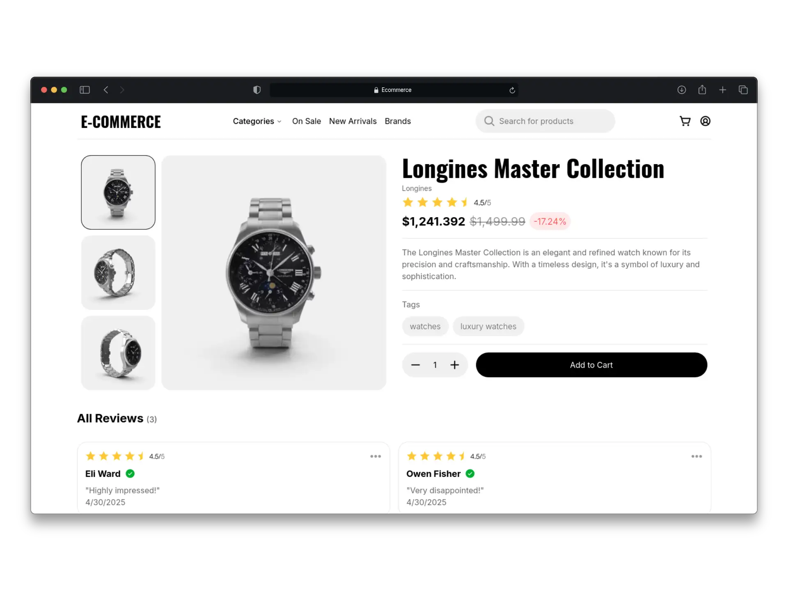
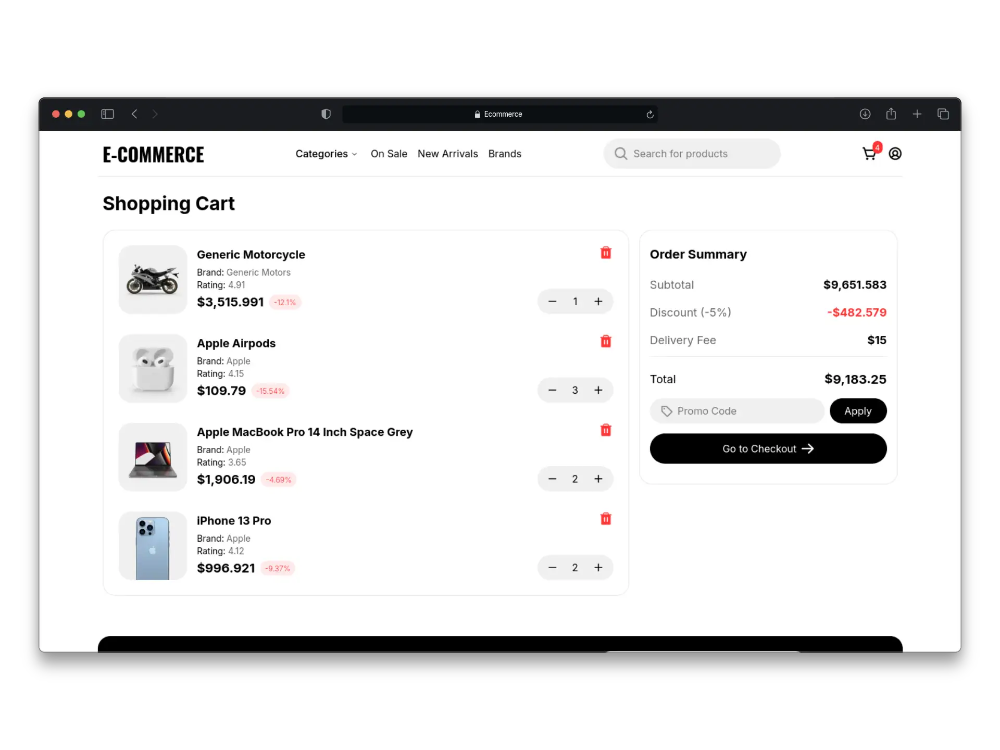

# Ecommerce NextJs - Ecommerce Web Application with Shopping Cart

### Description
Web application that simulates a full-featured E-commerce store, including product listings, a shopping cart, and filtered search. It uses an external API to fetch real-time product data. The project was built with Next.js, following best practices such as the proper use of Server Components, dynamic routes, and efficient client-side state management. It features a modern, responsive interface optimized for performance.

### Links
[Link to Web](https://nextjs-ecommerce-two-wine.vercel.app/)

### Tech Stack
* React
* NextJs
* Typescript
* Vercel
* Tailwind Css
* Zustand

### Screenshots

